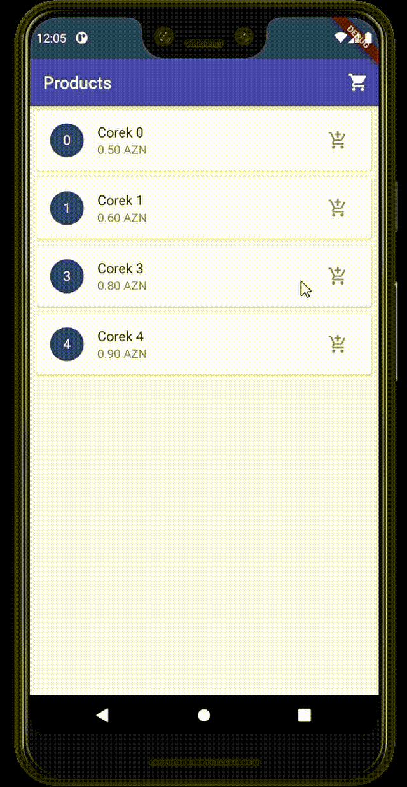

# Pure Flutter with Cart Example

    <table>
        <tr>
            <td style="text-align: center">
                    
            </td>            
            <td style="text-align: center">
                    
            </td>     
        </tr>
    </table>

App was written using Pure Flutter. It contains the following topics:
- InheritedWidget
- ValueNotifier (Custom ValueNotifier)
- ValueListenableBuilder
